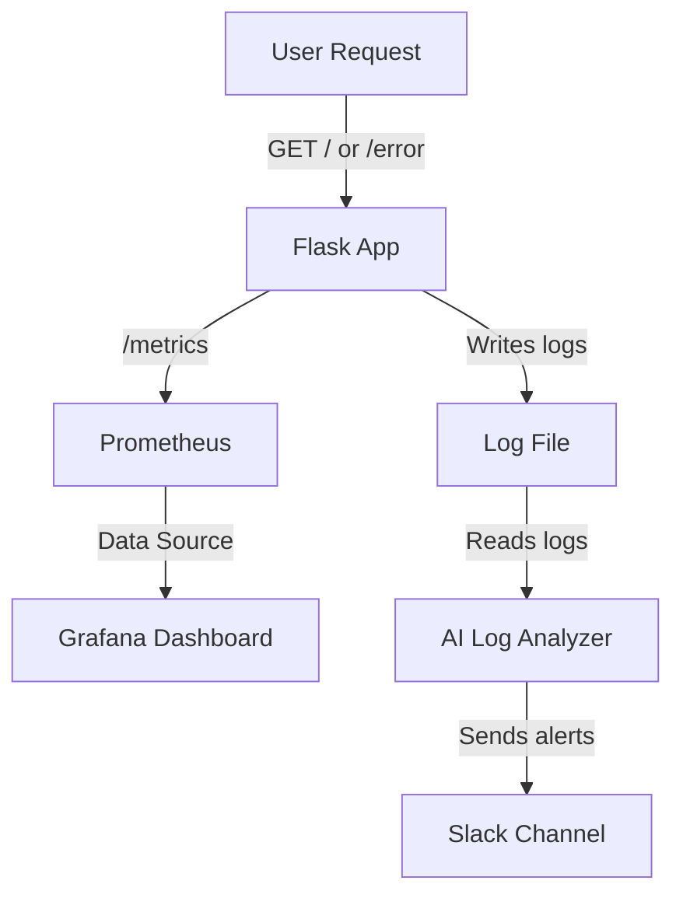

#  AI-Powered Log Monitoring & Alerting with Prometheus + Grafana

A lightweight DevOps project that combines **Python**, **Prometheus**, **Grafana**, and **OpenAI** to analyze logs, detect anomalies, and alert you via **Slack**. Ideal for AI-integrated monitoring workflows in modern microservices.

---

## 📊 Architecture Overview



---

## 🔧 Tech Stack

- **Python** (Flask for app, log analyzer)
- **Prometheus** for metrics scraping
- **Grafana** for metrics visualization
- **Docker & Docker Compose**
- **Slack Webhooks** for anomaly alerting
- **OpenAI API** for log anomaly detection

---

## 🚀 How It Works

1. A Flask app serves traffic at `/` and `/error`, and logs each request.
2. Logs are written to a file under `/logs/app.log`.
3. A Prometheus counter tracks every incoming request and is exposed at `/metrics`.
4. Prometheus scrapes `/metrics` every 15s.
5. Grafana pulls metrics from Prometheus and displays dashboards.
6. An AI-powered script (`log_analyzer.py`) analyzes recent logs using GPT.
7. If suspicious logs are detected, it sends a Slack alert.

---

## 🐳 How to Run the Project

### 1. Clone the Repository

```bash
git clone https://github.com/your-username/ai-agent-log-monitoring.git
cd ai-agent-log-monitoring
```

### 2. Set Up Environment Variables

Create a `.env` file:

```env
OPENAI_API_KEY=your_openai_key
SLACK_WEBHOOK_URL=your_slack_webhook
```

---

### 3. Run with Docker Compose

```bash
docker-compose up --build
```

This will start:
- Flask app at `http://localhost:5004`
- Prometheus at `http://localhost:9090`
- Grafana at `http://localhost:3000`

---

### 4. Use the App

Generate logs:
```bash
curl http://localhost:5004/
curl http://localhost:5004/error
```

---

### 5. Analyze Logs with GPT (AI)

```bash
source venv/bin/activate  # or .\venv\Scripts\activate on Windows
python log_analyzer.py
```

---

## 📈 Grafana Dashboard Setup

1. Go to `http://localhost:3000`
2. Login (default: admin / admin)
3. Add Prometheus data source (`http://prometheus:9090`)
4. Create a dashboard panel
5. Example PromQL queries:

```promql
request_count
rate(request_count[1m])
```

---

## 📦 Folder Structure

```
AI_agent_project/
│
├── app.py                   # Flask web app
├── log_analyzer.py          # AI log parser
├── prometheus.yml           # Prometheus config
├── docker-compose.yml       # Docker services
├── logs/app.log             # Generated logs
└── README.md                # You're here
```

---

## 🛠 Example Slack Alert

> ⚠️ *AI Agent Alert:* Anomaly detected in `logs/app.log`. Pattern indicates potential issue: **simulation failed**

---

## 📸 Screenshot Preview


---

## 💡 Future Improvements

- Add email/SMS notifications
- Integrate with Loki for log collection
- Add anomaly score threshold
- Use FastAPI + Gunicorn for production deployment

---

## 🤝 Contributing

Pull requests are welcome. Let's make DevOps smarter with AI.

---


